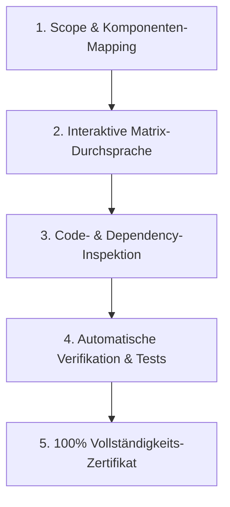

# Feature & Mechanic Implementation Audit

Dieser Skill definiert das interaktive Prüfprotokoll für die systematische Auditierung einzelner Spielmechaniken und Features in *Archiv des Vergessens*. Ziel ist der Nachweis und die Gewährleistung einer **100%igen Implementierungs-Vollständigkeit** über alle Systemschichten hinweg.

---

## 🎯 Ziel & Einsatzbereich

Verwende diesen Skill, wenn:
- Ein neues Feature oder eine Spielmechanik vollständig fertiggestellt wurde und auf 100% Vollständigkeit geprüft werden soll.
- Ein Refactoring an einer bestehenden Mechanik durchgeführt wurde und alle Abhängigkeiten verifiziert werden müssen.
- Eine interaktive Schritt-für-Schritt-Prüfung zusammen mit dem Entwickler gewünscht ist.

---

## 🏛️ Die 5 Säulen der 100%igen Implementierung

Ein Feature gilt erst dann als zu 100% implementiert, wenn alle 5 Säulen vollständig abgedeckt und verifiziert sind:

### 1. UI & Visuals (Preact / Vanilla DOM)
- [ ] **State Rendering:** Visuelle Darstellung für alle Zustände (Inaktiv, Aktiv, Gesperrt, Loading, Error).
- [ ] **User Feedback:** Relevante Tooltips, Modal-Dialoge, Animationen oder Feedback bei Aktionen (z.B. Ressourcen-Kauf, Item-Equip).
- [ ] **Reaktivität:** UI aktualisiert sich automatisch bei State-Änderungen über den Event-Bus ohne manuelles Neuladen.

### 2. Client-Logik & State Management
- [ ] **State Manager:** Richtige Einbindung in den `StateManager` und Dependency Injection (`js/core/di/`).
- [ ] **Event Bus:** Event-Abonnements und -Emissionen sind entkoppelt und speicherleckfrei aufgesetzt.
- [ ] **Optimistic Updates & Rollback:** Frontend reagiert flüssig, stellt aber den Ursprungszustand wieder her, falls der Server die Aktion ablehnt.

### 3. WebSocket Event Contract & Netzwerk
- [ ] **Schema-Validierung:** Payload-Strukturen für Client- und Server-Events eingehalten und validiert.
- [ ] **Disconnect & Reconnect:** Verhalten bei abgebrochener WebSocket-Verbindung abgefangen (keine unvollständigen States).
- [ ] **Rate-Limiting & Buffering:** Keine Überlastung der Verbindung bei schnellen Eingaben (z.B. Spam-Clicks).

### 4. Server-Logik, Validation & Datenbank (SQLite)
- [ ] **Server-Side Validation:** Sämtliche Aktionen werden serverseitig auf Validität (Kosten, Cooldowns, Voraussetzungen) geprüft (Zero-Client-Trust).
- [ ] **Synchrones `better-sqlite3`:** Persistence-Layer speichert Änderungen korrekt in der SQLite-Datenbank.
- [ ] **Transaktionssicherheit:** Mehrstufige Operationen laufen in DB-Transaktionen ab, um Inkonsistenzen zu verhindern.

### 5. Edge Cases, Math & Offlinelogik
- [ ] **BigInt / Zahlengrenzen:** Große Zahlenwerte und Skalierungen werden korrekt ohne Precision-Loss berechnet.
- [ ] **Idle & Offline Progression:** Ticks und Offline-Berechnungen berücksichtigen die Mechanik korrekt.
- [ ] **Grenzfälle:** Nullwerte, negative Werte, Maximalstufen und volle Inventare lösen keine Unhandled Exceptions aus.

---

## 🔄 Interaktiver Prüfungs-Ablauf (Audit Workflow)

Das Audit erfolgt in 5 klar strukturierten Schritten:



### Schritt 1: Scope & Komponenten-Mapping
1. Liste alle beteiligten Dateien auf (Frontend Components, Client Services, WS Endpoints, Server Services, DB Tables, Tests).
2. Erstelle eine Funktionsübersicht der Mechanik (z.B. "Sockeln von Edelsteinen", "Pakt-Auswahl", "Ressourcen-Generator").

### Schritt 2: Interaktive Matrix-Durchsprache
Gehe mit dem Entwickler / für die Mechanik jede der 5 Säulen durch und überprüfe:
- Gibt es Platzhalter, `TODO`s, Dummies oder leere Fallback-Methoden?
- Werden Fehlermeldungen verständlich im UI angezeigt?

### Schritt 3: Code- & Dependency-Inspektion
- **Grep-Check:** Suche im Code nach verbliebenen `// TODO`, `// FIXME`, `console.log` Debug-Leichen.
- **Import Check:** Sicherstellen, dass keine unerlaubten Bibliotheken verwendet werden.

### Schritt 4: Automatische Verifikation & Tests
Führe die folgenden Validierungen aus:
1. **Typechecking:** `npx tsc --noEmit -p tsconfig.json` (sofern TS/JSDoc vorkommt).
2. **Unit Tests:** `npm run test` oder `npx vitest run` zur Prüfung der mathematischen und logischen Invarianten.
3. **Live/Server-Connection Check:** Prüfe WebSocket-Events bei aktiver Server-Verbindung.

### Schritt 5: 100% Vollständigkeits-Zertifikat
Erstelle einen abschließenden Bericht im folgenden Format:

```markdown
## 📋 Audit-Zertifikat: [Feature/Mechanik Name]

- **Status:** [100% Vollständig / Unvollständig]
- **Geprüfte Schichten:**
  - [x] UI / Visuals
  - [x] Client State & Events
  - [x] WebSocket Contracts
  - [x] Server Validation & DB
  - [x] Edge Cases & Idle Math
- **Gefundene & Behobene Lücken:** (Keine / Auflistung)
- **Verifizierte Tests:** `vitest run` [PASSED]
```

---

## 🛑 Do Not Use

- Nicht als 100% abgeschlossen markieren, wenn nur die Benutzeroberfläche existiert, aber die serverseitige Validierung oder DB-Persistenz fehlt.
- Reine Sichtprüfungen im Browser reichen nicht aus – die Datenbank-Einträge (`better-sqlite3`) und WebSocket-Payloads müssen immer mitgeprüft werden.
