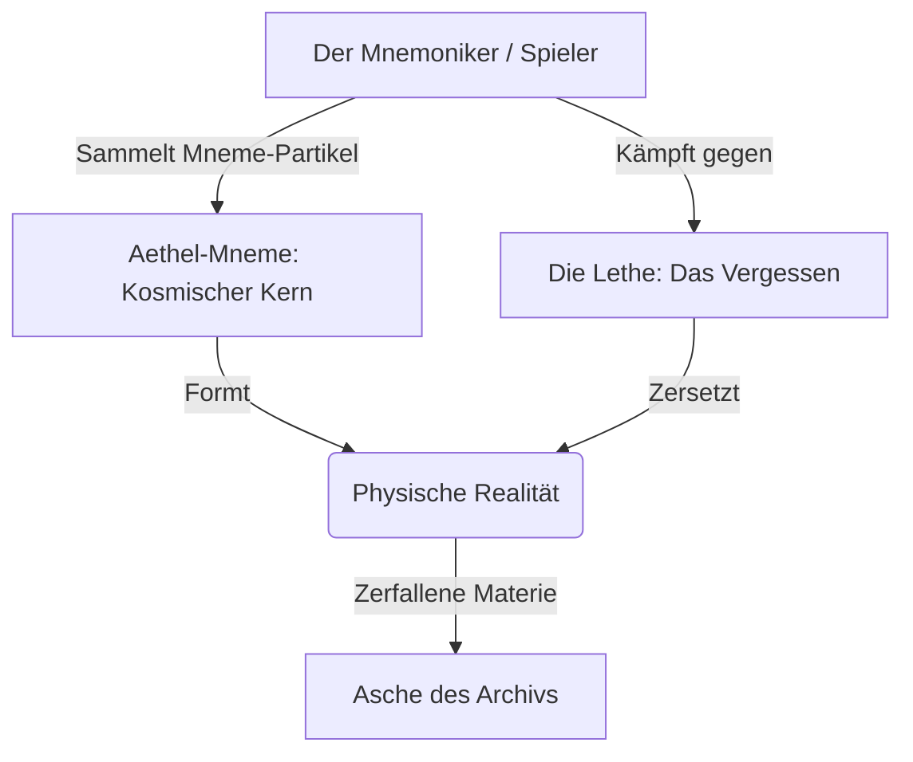

# 🌌 ARCHIV DES VERGESSENS: AAA NARRATIVE DESIGN BIBLE
*„Die Realität ist kein physischer Ort. Sie ist ein feines Gespinst aus Träumen und Erinnerungen. Und wir sind die Spinnen, die den Faden spinnen – oder ihn abschneiden.“*

Dieses Dokument erhebt den intimen, atmosphärischen Kern von **Archiv des Vergessens** auf das Niveau eines cineastischen AAA-Meisterwerks. Es erweitert das bestehende System (aus [story_branches.js](file:///f:/Max_Projekte/archiv-des-vergessens/js/data/story_branches.js) und [dialogs.js](file:///f:/Max_Projekte/archiv-des-vergessens/js/data/dialogs.js)) in eine epische, philosophische und visuell atemberaubende Saga im Stile von *Nier: Automata*, *Elden Ring* und *Control*.

---

## 🧭 Inhaltsverzeichnis
1. [Kosmologie & Tonalität](#-1-kosmologie--tonalität)
2. [Die Kernfraktionen & Moralisches Dilemma](#-2-die-kernfraktionen--moralisches-dilemma)
3. [Die Tragödie der Verlorenen Epochen (Bosse & Lore)](#-3-die-tragödie-der-verlorenen-epochen-bosse--lore)
4. [Das Gameplay-Narrativ: Mechanische Verwebung](#-4-das-gameplay-narrativ-mechanische-verwebung)
5. [Cineastischer Story-Bogen & Kapitel-Szenarien](#-5-cineastischer-story-bogen--kapitel-szenarien)
6. [Beispiel-Dialoge mit AAA-Gewicht](#-6-beispiel-dialoge-mit-aaa-gewicht)

---

## 🌌 1. Kosmologie & Tonalität

### Die Ontologie der Mneme
In einer AAA-Prämisse ist **Mneme** nicht bloß eine Sammel-Ressource für Upgrades, sondern die **essenzielle atomare Struktur der Realität**. Materie, Zeit und Gravitation existieren nur, weil sich das kollektive Bewusstsein an sie erinnert. 
* Wenn eine Stadt vergessen wird, zersetzen sich ihre physischen Mauern in feinsten, grauen Sand.
* Wenn eine Epoche vergessen wird, bricht ein ganzer Kontinent aus der Realität heraus und hinterlässt ein stellares Vakuum.

### Das Archiv (The Great Repository)
Das Archiv ist ein unmöglicher, metaphysischer Raum außerhalb der Zeit. Es ist der letzte Anker der Existenz. 
* **Die Ästhetik**: Brutalistische Marmorarchitektur verschmilzt mit surrealer Kosmologie. Unendlich hohe Wände aus schwebenden Buchregalen, Wasserfälle aus flüssiger Tinte, riesige, langsam rotierende Astrolabien aus Licht und Brücken, die sich nur materialisieren, wenn der Charakter aktiv an ein bestimmtes Gefühl denkt. 
* **Das Wetter**: Es schneit permanent feine, glitzernde Asche – die zerfallenen Überreste vergessener Geschichten.

### Die Lethe (Das Vergessen)
Das Vergessen ist kein passiver Zustand der Leere, sondern eine **aktive, hungrige Urkraft** (Die Lethe). Sie kriecht als zäher, öliger, purpurn-schwarzer Nebel durch das Archiv. Die Lethe sucht die Erinnerungen nicht nur heim, sie korrumpiert sie. Sie verwandelt stolze geschichtliche Fragmente in gequälte, feindselige Echos und albtraumhafte Bosse.



---

## ⚔️ 2. Die Kernfraktionen & Moralisches Dilemma

AAA-Titel brillieren durch das Aufbrechen von Schwarz-Weiß-Malerei. Keine Fraktion ist absolut gut oder böse. Der Spieler steht zwischen drei philosophischen Strömungen:

### A. Der Mneme-Bund (Die Bewahrer)
* **Anführer**: *Archivar Theron* & *Wächterin Elara*
* **Philosophie**: Erhaltung um jeden Preis. Jede Erinnerung – ob glückselig oder von absolutem Grauen erfüllt (Kriege, Seuchen) – muss in den Kammern weggesperrt und konserviert werden. Denn jede gelöschte Erinnerung schwächt die Stabilität der Welt.
* **Die dunkle Wahrheit**: Sie sind Gefängniswärter des Geistes. Um das Archiv stabil zu halten, zwingen sie die Geister der Vergangenheit in eine ewige, stagnierende Agonie. Sie verbieten jede Weiterentwicklung, da Veränderung immer ein Vergessen des Alten erfordert.

### B. Die Lethe-Apostel (Die Quietisten)
* **Anführer**: *Nyx, die Stimme des Schattens*
* **Philosophie**: Die Erlösung der Auslöschung. Sie argumentieren, dass das Festhalten an einer sterbenden Vergangenheit das Leiden der Menschheit nur unendlich verlängert. Vergessen ist kein Verlust, sondern die ultimative Gnade – ein schmerzfreier Frieden im warmen Nichts.
* **Die dunkle Wahrheit**: Ihr „Frieden“ bedeutet die vollkommene Auslöschung aller Individualität, Gefühle und des nackten Daseins.

### C. Die Freien Wanderer (Die Chrono-Rebellen)
* **Anführer**: *Händlerin Mira*
* **Philosophie**: Dynamischer Wandel. Die Mneme darf nicht in toten Archiven weggesperrt werden. Sie muss verbrannt, transformiert und als Treibstoff für etwas völlig Neues genutzt werden. Sie akzeptieren, dass Altes sterben muss, damit Neues wachsen kann.
* **Die dunkle Wahrheit**: Ihre Experimente führen zu instabilen, wilden Anomalien in der Realität, die unvorhersehbare Katastrophen auslösen können.

---

## 🏛️ 3. Die Tragödie der Verlorenen Epochen (Bosse & Lore)

Jeder Boss in *Archiv des Vergessens* verkörpert eine verlorene Epoche der Menschheit. Im AAA-Format sind sie keine bloßen HP-Balken, sondern tragische, monumentale Hüter, die durch die Korruption der Lethe verzerrt wurden.

```
+-----------------------------------------------------------------------------------+
|                           EPOCHEN- & BOSS-ÜBERSICHT                               |
+----------------------+---------------------------+--------------------------------+
| Boss                 | Verkörperte Epoche        | Tragischer Kern                |
+----------------------+---------------------------+--------------------------------+
| Malakor, der Erste   | Ära des gläsernen Himmels | Wollte alles Leid in sich      |
|                      | (Utopische Flugstädte)    | aufsaugen und erstickte daran. |
+----------------------+---------------------------+--------------------------------+
| Aurelia, das Meer    | Zeitalter des Erzes       | Opferte ihre Stimme für ein    |
|                      | (Maritime Großreiche)     | Lied, das nun stumm gefriert.  |
+----------------------+---------------------------+--------------------------------+
| Goliath-7            | Die kybernetische Dämmer- | Eine gigantische Maschine, die |
|                      | ung (Techno-Endzeit)      | Schöpfer schützt, die weg sind.|
+----------------------+---------------------------+--------------------------------+
| Der Vergessene Gott  | Die Ur-Erinnerung         | Das allererste Konzept von     |
|                      | (Mythologische Urzeit)    | Glaube, das nun im Staub liegt.|
+----------------------+---------------------------+--------------------------------+
```

### 1. Boss: Malakor, der gefallene Erste (Ehemals "Verlorener Schatten")
* **Visuelles Design**: Eine hochgewachsene, ritterliche Silhouette aus reinem, obsidianfarbenem Glas. In seiner Brusthöhle rotiert ein weites, goldenes Uhrwerk, das jedoch von schwarzen Schlieren der Lethe blockiert wird. Sein Schwert besteht aus purem, kondensiertem Sternenlicht, das flackert.
* **Die Lore**: Malakor war der allererste Mnemoniker des Bundes. Als die erste Welle der Lethe das Archiv traf, opferte er seinen eigenen Verstand, um die Erinnerungen einer ganzen goldenen Ära der Wissenschaften in sich aufzunehmen. Doch die schiere Last des Wissens und des Schmerzes korrumpierte ihn. Er wandert nun durch die Hallen, unfähig zu sterben, gefangen in einem endlosen Loop seines größten Triumphs und seines tiefsten Falls.
* **Kampf-Atmosphäre**: Ein Duell im *Asche-Garten*. Klassische Chöre im Hintergrund verschmelzen mit dem Ticken eines riesigen Metronoms. Bei jedem Schlag verändert sich die Schwerkraft der Arena.

### 2. Boss: Aurelia, das schweigende Meer (Ehemals "Echo der Stille")
* **Visuelles Design**: Eine riesige, wehmütige Frauenfigur, halb aus blau schimmerndem Tiefseekristall, halb aus gefrorenem Nebel. Sie trägt ein Kleid aus flüssiger Tinte, das hinter ihr herzieht und in dem Sternenkonstellationen schwimmen.
* **Die Lore**: Aus der maritimen Epoche von *Valanis*. Als das Meer der Erinnerungen zu verdampfen drohte, sang Aurelia – die Hohepriesterin – ein ununterbrochenes Lied, um die Fluten zu binden. Doch als die Lethe ihr Volk vergessen ließ, wer Aurelia war, versiegte die Magie. Sie gefror zu einer weinenden Säule aus Kristall. Sie kämpft nicht aus Bosheit, sondern weil sie jeden Eindringling als den Nebel wahrnimmt, der ihr Volk verschlang.
* **Kampf-Atmosphäre**: Ein Kampf auf einer schwebenden Plattform über einem tintenartigen, unendlichen Ozean. Der Soundtrack ist ein herzzerreißender, wortloser Sopran-Gesang, der mit dem Klirren von berstendem Eis bricht.

### 3. Boss: Goliath-7 (Ehemals "Wächter des Abgrunds")
* **Visuelles Design**: Ein titanischer, brutalistischer Koloss aus rostigem Eisen, durchsetzt mit freiliegenden, pulsierenden Datenkabeln, die blaues Mneme-Licht führen. Seine Augen sind Projektoren, die verpixelte Holograme einer hochentwickelten Metropole in den Raum werfen.
* **Die Lore**: Ein Relikt der *Kybernetischen Dämmerung*. Goliath-7 wurde programmiert, um die Zentral-Datenbank einer sterbenden Zivilisation vor der physischen Vernichtung zu schützen. Das Reich ging unter, die Menschen starben, doch der Code von Goliath-7 läuft weiter. Er bewacht nun ein leeres Archiv und sieht im Spieler ein unbefugtes Programm, das gelöscht werden muss.
* **Kampf-Atmosphäre**: Schwere, mechanische Industrial-Beats. Der Boss wirft Hologramme von unschuldigen Bürgern auf das Schlachtfeld, die den Spieler ablenken und verwirren.

---

## 4. Das Gameplay-Narrativ: Mechanische Verwebung

Ein AAA-Titel zeichnet sich dadurch aus, dass Story-Entscheidungen die Gameplay-Mechaniken des Idle-RPGs direkt beeinflussen. Dies hebt das Konzept von [lore-nodes.js](file:///f:/Max_Projekte/archiv-des-vergessens/js/data/lore-nodes.js) auf ein neues Level:

### Die Mneme-Synthese (Das Skill-System)
Der Spieler sammelt zwei Arten von Energie, die im ständigen Widerstreit stehen:

1. **Aethel-Mneme (Ordnung/Erhalt)**:
   * *Gewinnung*: Durch das Rekonstruieren historischer Daten und das Verschließen von Lethe-Rissen.
   * *Effekt*: Stärkt die Verteidigung, schaltet passive Heilung frei und erhöht die Qualität geschmiedeter Gegenstände (Lehre des Erzes).
   * *Visuell*: Goldene, geometrische Partikel-Effekte im UI.

2. **Lethe-Asche (Chaos/Auslöschung)**:
   * *Gewinnung*: Durch das bewusste Zersetzen/Vergessen von unwichtigen oder schmerzhaften Erinnerungen und den Pakt mit Nyx.
   * *Effekt*: Massiver Schadensboost, Erhöhung der kritischen Trefferchance, aber verringert die maximale Gesundheit. Schaltet verbotene Schatten-Fertigkeiten frei.
   * *Visuell*: Purpurne, rauchige Partikel-Effekte, die das UI langsam "korrumpieren" und abdunkeln.

### Dynamisches Story-Branching-System
Deine Entscheidungen im Story-Baum (z.B. in [story_branches.js](file:///f:/Max_Projekte/archiv-des-vergessens/js/data/story_branches.js)) verändern die Spielwelt und das HUB (Das Archiv) visuell:
* **Pfad des Wächters**: Das Archiv wird prunkvoller. Goldene Banner hängen von den Wänden, Theron sitzt auf einem Thron aus Büchern, das Licht ist warm und einladend. Die Musik ist orchestral und heroisch.
* **Pfad des Schattens**: Der purpurne Nebel dringt in das HUB ein. Die Regale wirken verwittert, die NPCs flüstern nur noch in Angst oder Apathie. Die Musik wird minimalistisch, unheimlich und bedrückend.

---

## 5. Cineastischer Story-Bogen & Kapitel-Szenarien

Hier ist der detaillierte Aufriss des dramaturgischen Bogens, der die bestehenden Story-Knotenpunkte veredelt:

```
[PROLOG: Das Erwachen der Asche]
               |
      +--------+--------+
      | (Kampf)         | (Flucht)
      v                 v
[KAPITEL 1:         [KAPITEL 1:
 Der Heldenweg]      Der Weg der Schande]
      |                 |
      +--------+--------+
               |
[KAPITEL 2: Die Konfrontation der Philosophien]
               |
      +--------+--------+-----------------+
      | (Bund beitreten)| (Eigener Weg)   | (Mit Nyx paktieren)
      v                 v                 v
[KAPITEL 3:         [KAPITEL 3:       [KAPITEL 3:
 Die eiserne       Der freie         Die Flüstern der
 Ordensregel]       Wanderer]         Schatten-Leere]
      |                 |                 |
      +-----------------+-----------------+
                        |
[KAPITEL 4: Die kosmische Mneme-Synthese]
                        |
    +-------------------+-------------------+
    |                   |                   |
    v                   v                   v
[ENDING A:          [ENDING B:          [ENDING C:
 Sieg des Lichts]    Die Befreiung]      Die absolute Leere]
(Konservierung)     (Wandel/Neuanfang)  (Erlösendes Nichts)
```

### Prolog: Das Erwachen der Asche
* **Szene**: Der Spieler erwacht in einem endlosen Feld aus weißer Asche. Über ihm erstreckt sich kein Himmel, sondern ein schwarzer Abgrund, in dem gigantische, brennende Buchseiten wie Kometen vorbeiziehen. Im Zentrum ragt der *Turm der Ewigkeit* empor, dessen Spitze im Nichts verschwindet.
* **Begegnung**: Malakor stellt sich dem Spieler in den Weg. Seine Stimme klingt wie das Echo von tausend brechenden Schwertern.
  * *Option A (Angriff)*: Der Spieler zieht eine Klinge aus gefrorenem Licht. Der Kampf ist intensiv, ein wilder Tanz der Klingen im Ascheregen. (Schaltet `hero_path` frei).
  * *Option B (Flucht)*: Der Spieler weicht zurück und stürzt in ein Portal aus schwebenden Buchseiten, gejagt vom Spott des Schattens. (Schaltet `coward_path` frei).

### Kapitel 2: Das Treffen der Giganten (Die Konfrontation)
Der Spieler erreicht das *Auge des Archivs* (Das HUB). Hier treffen die Ideologien aufeinander.
* **Cineastischer Moment**: Archivar Theron steht vor dem monumentalen *Aethel-Core*, der schwach pulsiert. Zur gleichen Zeit manifestiert sich Nyx als wunderschöne, tragische Silhouette aus flüssigem Schatten am Rand der Plattform.
* **Das Dilemma**: Theron fordert dich auf, die heraufziehende Flut an Lethe-Energie gewaltsam einzudämmen. Nyx bittet dich, die Tore zu öffnen, damit die gequälten Geister endlich ruhen können.
* **Spielerentscheidung**:
  * *Pfad des Ordens*: Du hilfst Elara, die Siegel zu verstärken. (Schaltet exklusive Paladin-Upgrades frei).
  * *Pfad der Rebellen*: Du verbündest dich mit Mira, um die Mneme-Partikel auf dem Schwarzmarkt für instabile Modifikationen zu nutzen.
  * *Pfad des Schattens*: Du flüsterst mit Nyx und nimmst den Lethe-Pakt an. Deine Angriffe erhalten purpurnes Feuer, aber dein Charakter verliert seine menschliche Gestalt und wird zunehmend ätherisch.

### Das Finale: Die Kosmische Mneme-Synthese
Der Kampf gegen den *Vergessenen Gott* (Der Ursprung der Lethe).
* **Die Arena**: Ein surrealer, unmöglicher Raum, in dem physikalische Gesetze aufgehoben sind. Trümmer aller vergangenen Epochen (griechische Säulen, cybernetische Server-Racks, antike Schiffe) wirbeln im Kreis.
* **Die Auflösung**: Der Boss ist kein Monster, sondern das allererste Bewusstsein der Menschheit, das verzweifelt versucht, sich selbst vor dem Vergessen zu schützen. Der Kampf ist eine emotionale Achterbahnfahrt.

---

## 6. Beispiel-Dialoge mit AAA-Gewicht

Um die emotionale Tiefe des Schreibens zu demonstrieren, sind hier die Dialoge aus [dialogs.js](file:///f:/Max_Projekte/archiv-des-vergessens/js/data/dialogs.js) auf AAA-Niveau umgeschrieben:

### Begegnung mit Archivar Theron (Der Hüter der Schriften)

```markdown
[Theron steht vor einer gigantischen Wand aus erlöschenden Lichtglyphen. Seine Hand zittert, als er versucht, ein verblassendes Symbol nachzuzeichnen.]

Theron:
"Siehst du das, Wanderer? Jedes Mal, wenn das Licht einer dieser Glyphen erlischt, vergisst ein Kind auf einer fernen, sterbenden Welt das Gesicht seiner Mutter. Wenn eine ganze Zeile stirbt, vergisst eine Nation ihre Sprache. 
Wir sammeln hier nicht nur Geschichten. Wir halten die Trümmer der Existenz mit unseren blutenden Händen zusammen. 
Die Wächter nennen es Pflicht. Ich... ich nenne es eine wunderschöne, grausame Folter. Wirst du uns helfen, diese Last zu tragen, oder wirst du zusehen, wie der letzte Faden reißt?"
```

### Begegnung mit Nyx (Die Stimme des Schattens)

```markdown
[Nyx manifestiert sich aus dem Schatten des Spielers. Sie hat keine feste Form, aber ihre Silhouette erinnert an eine trauernde Mutter. Ihre Stimme ist ein sanftes, beruhigendes Rauschen.]

Nyx:
"Warum wehrst du dich so vehement gegen den Schlaf, kleiner Mnemoniker? 
Sieh dir Theron an. Er hat seinen eigenen Namen vor dreihundert Jahren vergessen, nur um das Rezept einer antiken Medizin zu bewahren, die niemand mehr herstellen kann. Ist das Leben? Ist das Bewahrung? 
Das Archiv ist ein goldenes Mausoleum. Eine ewige Folterkammer der Nostalgie. 
Lass mich dir die Last nehmen. Lass uns die Siegel brechen. Wenn alles vergessen ist, gibt es keinen Schmerz mehr. Keine Kriege. Keine Reue. Nur die unendliche, sanfte Stille des Urvakuums. Ist das nicht der wahre Frieden, nach dem du dich sehnst?"
```

### Begegnung mit Wächterin Elara (Die eiserne Hüterin)

```markdown
[Elara poliert ihre massive Rüstung, die mit den Runen längst vergessener Helden graviert ist. Sie sieht den Spieler mit kalten, entschlossenen Augen an.]

Elara:
"Sie nennen mich kalt. Sie sagen, ich hätte kein Herz mehr, weil ich nicht weine, wenn eine Epoche im Nebel versinkt. 
Aber sie verstehen es nicht. Wenn ich weinen würde, würde der Schmerz mich zerreißen. Meine Rüstung hält nicht nur die Schwerter der Feinde ab, sie hält meine Seele zusammen. 
Ich habe meine Familie im großen Kollaps verloren. Ich erinnere mich nicht mehr an ihre Stimmen... aber ich erinnere mich an das Versprechen, das ich ihnen gab. Das ist meine Mneme. Das ist mein Schild. 
Wenn du hier kämpfen willst, musst du lernen, deinen Schmerz als Waffe zu führen. Sonst wirst du sehr schnell zu einem weiteren namenlosen Echo in diesen Korridoren."
```

---

> [!TIP]
> **Narrativer Design-Tipp für die Implementierung**:
> Um diese AAA-Tiefe im aktuellen Preact/Tauri-Projekt umzusetzen, können wir die Partikel-Effekte auf dem Canvas-Hintergrund dynamisch an die Story-Entscheidungen des Spielers koppeln. Ein hoher `Aethel-Mneme`-Wert färbt die Partikel gold-geometrisch, während ein hoher `Lethe`-Wert die Partikel organisch-purpurn und rauchig fließen lässt. Dies schafft eine direkte visuelle Rückkopplung (Visual Storytelling) auf höchstem Niveau!
