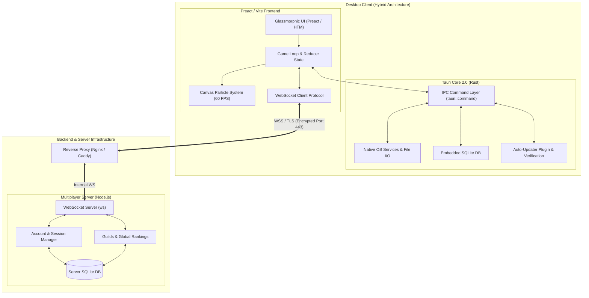

# Archiv des Vergessens – Der Mneme-Bund

<p align="center">
  
</p>

<p align="center">
  <strong>Die Realität verblasst. Die Erinnerungen sterben.</strong><br>
  <em>Wirst du sie bewahren?</em>
</p>

<p align="center">
  <a href="https://github.com/Trobikus/archiv-des-vergessens/actions/workflows/test.yml">
    
  </a>
  <a href="https://github.com/Trobikus/archiv-des-vergessens/releases/latest">
    
  </a>
  <a href="LICENSE">
    
  </a>
  <a href="https://codecov.io/gh/Trobikus/archiv-des-vergessens">
    
  </a>
  
  
  
</p>

**Archiv des Vergessens** ist ein atmosphärisches, hybrides **Idle-RPG** mit narrativer Tiefe, Echtzeit-Multiplayer, deutschem Idle-Formatierungsstandard, modernem Glassmorphic AAA-Design und einer einzigartigen Welt rund um Erinnerung, Vergessen und die Macht der Mneme.

---

## 📖 Die Geschichte

In einer Welt, in der die Realität langsam zerfällt, ist das **Archiv** der letzte Hort der Erinnerungen der Menschheit. Als Hüter der Mneme sammelst du verblassende Fragmente der Vergangenheit, kämpfst gegen das Vergessen selbst und baust Allianzen mit anderen Wanderern auf.

Jedes Partikel, das du sammelst, birgt eine Geschichte. Jeder Boss verkörpert eine verblasste Epoche. Jede Entscheidung formt nicht nur deinen Charakter, sondern trägt dazu bei, die Welt vor dem endgültigen Verlöschen zu bewahren.

---

## ✨ Highlights & Features

- **Tiefes Idle-Progression-System**:
  - Exponentielles Wachstum mit Branchenstandard-Formeln ($1.15^L$ Steigerung)
  - **Deutsche Zahlenformatierung**: Elegante Notation (`Tsd.`, `Mio.`, `Mrd.`, `Bio.`, `Brd.` bis hin zu wissenschaftlicher Notation)
  - **Prestige-System**: Schalte *Ewige Mneme* frei (ab $10.000$ Mneme-Fragmenten) mit permanenten $+10\%$ Ertragsboosts
  - **Mengen-Kauf Option**: Mehrfachkauf (`x1`, `x10`, `x100`, `MAX`) für flüssige Progression
  - Offline-Progression mit automatischer Nachberechnung (bis zu 12 Stunden)
- **Ausrüstung & Schmiede**:
  - **Meister-Schmiede (Master Forge)**: Sockel- & Runensystem, Aufwertungen sowie Bulk-Verwertung (*Bulk Salvaging*)
  - **Kontoweite Truhe (Shared Vault)**: Sicherer Gegenstandstransfer zwischen Charakteren
- **Server-Account & Server-Persistence**:
  - Benutzerkonto mit Login, Registrierung oder Schnellstart via Gast-Zugang
  - Server-seitige SQLite-Persistenz mit automatischer Synchronisation über WebSockets, robuster Cloud-Hydrierung & automatischer Konfliktlösung
- **Echtzeit-Multiplayer & Clans**:
  - Globaler Chat & Gilden-Chat mit Chat-Verlauf
  - Clan- & Gilden-System mit dynamischen Rekrutierungskosten, Meilenstein-Multiplikatoren, Slot-Persistenz und Boss-EXP-Skalierung
  - Globale Bestenlisten (Rankings nach Prestige, Bossen und Stufe, exklusiv für registrierte Benutzer)
- **Visuelle & Technische Exzellenz**:
  - Nahtloser Standalone-Launcher mit Ed25519-Signaturprüfung und In-App-Updates (Tauri 2 Updater Plugin)
  - Kryptographisch sichere Entropie (`crypto.getRandomValues()`) in Auth, Network & Cloud-Sync
  - Ultra-performantes Canvas-Partikelsystem (Zero-Lag 60 FPS)
  - AAA Glassmorphic Dark UI, Custom Glow-Effekte & dynamische Vignetten
  - Vollständige Zweisprachigkeit (**Deutsch DE** & **Englisch EN**)

---

## 🏗️ Projekt-Architektur

Die Softwarearchitektur von **Archiv des Vergessens** kombiniert native Systemleistung mit moderner Web-Technologie und robuster Client-Server-Kommunikation.



### Zusammenwirken der Hauptkomponenten:

1. **Tauri Core (`src-tauri/` - Rust)**:
   - Fungiert als extrem leichtgewichtiger, performanter Native Backend-Wrapper.
   - Verwaltet native OS-Interaktionen (Window Framing, Tray Icons, lokale SQLite-Persistenz, Kryptographie & Signatur-Verifikation).
   - Stellt sichere, typsichere IPC-Commands (`tauri::command`) für das Frontend bereit.
   - Behandelt automatische In-App-Updates über den integrierten Tauri 2.0 Auto-Updater.

2. **Preact / Vite Frontend (`js/` & `index.html` - JavaScript/CSS)**:
   - Rendering der performanten, responsive Glassmorphic AAA UI mittels **Preact** & **HTM** ohne schweren Bundler-Overhead.
   - **Game Engine & State Management**: Zentraler Event-Bus (`core/EventBus.js`), Reducer-Architektur und DI-Container für vorhersagbare Statusänderungen.
   - **Performance Canvas**: Hardwarebeschleunigtes Canvas-Partikelsystem für flüssige 60 FPS Effekte.

3. **Node.js Dedicated Server (`server/` - Express/WebSockets)**:
   - Verwaltet die Multiplayer-Logik, weltweite Chat-Kanäle, Gilden-Systeme & globale Bestenlisten.
   - Verarbeitet Authentifizierung (Login, Register & nahtlose Gast-Migration).
   - Speichert Server-Accounts und Spielstände performant in einer serverseitigen SQLite-Datenbank (`better-sqlite3`).
   - Gesichert durch **Nginx / Caddy Reverse Proxies** für WSS (WebSocket Secure) Verschlüsselung.

---

## 📂 Projekt-Struktur (Monorepo-Architektur)

Das Repository ist als leichtgewichtiges Monorepo organisiert und vereint den Desktop-Client, den Multiplayer-Server und den Standalone-Launcher in einer zentralen Codebasis:

* **`/js` (Preact Frontend)**: Beinhaltet die komplette Frontend-Spiellogik, Reducer State-Management, Event-Bus und Preact/HTM UI-Komponenten.
* **`/src-tauri` (Rust Desktop Core)**: Stellt das native Tauri 2 Desktop-Backend in Rust bereit für OS-Integration, native Systemaufrufe, lokale SQLite-Persistenz und Auto-Update-Verifikation.
* **`/server` (Node.js Multiplayer Backend)**: Betreibt den dedizierten WebSocket-Server für Multiplayer, Chats, Gilden, globale Bestenlisten und serverseitige SQLite-Datenbankpersistenz (`better-sqlite3`).
* **`/launcher` (Standalone Launcher Sub-Projekt)**: Stellt einen separaten Tauri-Client für automatische App-Updates und den Anwendungsstart bereit.
* **`/css` (Design-System)**: Beherbergt das modulare Glassmorphic Dark-Designsystem, Theme-Variablen und Animationen.
* **`/deploy` (Deployment Infrastructure)**: Enthält gebrauchsfertige Reverse-Proxy- und SSL-Konfigurationen für Nginx und Caddy.
* **`/public` & `/i18n` (Assets & Lokalisierung)**: Beinhaltet statische Mediendateien (Texturen, Audio) sowie i18n-Dateien für Deutsch und Englisch.
* **`/.github/workflows` (CI/CD Pipelines)**: Automatisierte GitHub Actions für Vitest Unit-Tests, Cargo Test Suite, Code-Coverage und plattformübergreifende Releases.

### Ordnerübersicht:

```text
archiv-des-vergessens/
├── 📁 .github/workflows/    # CI/CD Pipelines (Rust Test-Suite, Coverage, Web-Deploy, Release)
├── 📁 css/                  # Glassmorphic Design-System (Animate, Glow, UI-Theming)
├── 📁 deploy/               # Server Deployment Configs (Nginx Reverse Proxy & Caddy Setup)
├── 📁 i18n/                 # Lokalisierungsdateien (Deutsch DE / Englisch EN)
├── 📁 js/                   # Frontend-Anwendungslogik & UI-Module (Preact + HTM)
│   ├── 📁 _tests_/          # Vitest Unit-Test-Suites (143 Tests in 22 Dateien)
│   ├── 📁 controllers/      # Game Controller (Idle-Progression, Audio, Inventory, Network)
│   ├── 📁 core/             # Central Event Bus, State Reducer & Dependency Injection
│   ├── 📁 managers/         # System Manager (Multiplayer Websockets, Save-Game, Auto-Save)
│   ├── 📁 models/           # Datenmodelle (Player, Items, Quests, Guilds, Achievements)
│   └── 📁 ui/               # Preact UI-Komponenten (Modals, HUD, Schmiede, Vault)
├── 📁 launcher/             # Standalone Launcher Sub-Projekt (Tauri 2 Updater Client)
├── 📁 public/               # Statische Assets (Audio, Texturen, Banner, Favicons)
├── 📁 scripts/              # Build-, Release- & Key-Generierungs-Hilfsskripte
├── 📁 server/               # Dedicated Node.js WebSocket- & Persistence-Server
│   ├── 📁 data/             # Server-Datenbank (SQLite Persistence)
│   └── 📄 server.js         # Echtzeit-Multiplayer Protocol & Server-Logik
├── 📁 src-tauri/            # Tauri 2 Desktop-Core (Rust)
│   ├── 📁 src/              # Rust Native Backend (Commands, Local DB, OS Services)
│   └── 📄 tauri.conf.json   # Tauri Client Konfiguration, Fenster & Security Policies
├── 📄 index.html            # Webgame HTML Entry-Point
├── 📄 package.json          # Node.js Abhängigkeiten, Test- & Build-Skripte
└── 📄 vite.config.js        # Vite Bundler Konfiguration
```

---

## 🖥️ Systemanforderungen

| Plattform | Minimum | Empfohlen |
| :--- | :--- | :--- |
| **Windows** | Windows 10, 4 GB RAM | Windows 11, 8 GB RAM |
| **macOS** | macOS 11 Big Sur | macOS 13 Ventura |
| **Linux** | Kernel 5.4+, glibc 2.28+ | Aktuelle Distribution |
| **Speicher** | 300 MB Festplatte | 1 GB SSD |

*Hinweis: Das Spiel läuft dank Rust & Tauri 2 extrem ressourcenschonend und flüssig.*

---

## 🚀 Schnellstart (Für Spieler)

1. Lade die neueste portable Version (`ArchivDesVergessens.exe`) von der [Releases-Seite](https://github.com/Trobikus/archiv-des-vergessens/releases/latest) herunter.
2. Starte die Anwendung – keine Installation erforderlich!
3. Der integrierte Launcher prüft automatisch auf Updates.
4. Erstelle einen Account oder starte direkt als Gast.
5. Der Client verbindet sich automatisch mit dem öffentlichen Multiplayer-Server:
   - **Öffentlicher Server**: `wss://grimoireinteractive.duckdns.org` (SSL-verschlüsselt, WSS)

---

## 💻 Entwicklung & Lokales Testen

### Voraussetzungen
- [Node.js](https://nodejs.org/) (v18 oder neuer)
- [Rust & Cargo](https://www.rust-lang.org/) (für Desktop-Builds)

### Befehle

```bash
# 1. Repository klonen
git clone https://github.com/Trobikus/archiv-des-vergessens.git
cd archiv-des-vergessens

# 2. Abhängigkeiten installieren
npm install

# 3. Web-Entwicklungsserver starten
npm run dev

# 4. Tauri Desktop-App im Entwicklungsmodus starten
npm run tauri:dev

# 5. Frontend Unit-Tests ausführen (Vitest)
npm run test

# 6. Backend Rust-Tests ausführen (Unit, Integration & E2E)
cargo test --manifest-path src-tauri/Cargo.toml

# 7. Rust Linter (Clippy) & Formatierung
cargo clippy --manifest-path src-tauri/Cargo.toml -- -D warnings
cargo fmt --manifest-path src-tauri/Cargo.toml -- --check

# 8. TypeScript Typenprüfung
npm run typecheck

# 9. Production Desktop-Build erstellen
npm run tauri:build
```

---

## 🔐 Deployment & Sicherheit (Reverse Proxy & SSL)

Um die Server-IP zu verbergen und sichere WSS-Verbindungen (WebSocket Secure) zu gewährleisten, wird der Node.js Backend-Server hinter einem Reverse Proxy betrieben.

### 1. Reverse Proxy Konfiguration
Konfigurationsdateien befinden sich im Ordner `deploy/`:
- **Nginx**: `deploy/nginx/nginx.conf`
- **Caddy**: `deploy/caddy/Caddyfile`

### 2. SSL-Zertifikat mit Let's Encrypt / Certbot (Nginx)

```bash
# Nginx & Certbot installieren
sudo apt update && sudo apt install nginx certbot python3-certbot-nginx -y

# Nginx Konfiguration kopieren & aktivieren
sudo cp deploy/nginx/nginx.conf /etc/nginx/sites-available/archiv-des-vergessens.conf
sudo ln -s /etc/nginx/sites-available/archiv-des-vergessens.conf /etc/nginx/sites-enabled/
sudo nginx -t && sudo systemctl reload nginx

# SSL-Zertifikat automatisch anfordern & konfigurieren
sudo certbot --nginx -d grimoireinteractive.duckdns.org
```

### 3. Konfigurationsverwaltung & Kryptographische Sicherheit (`config.toml`)

Alle kryptographischen Schlüssel, JWT-Secrets und Datenbankpasswörter werden zentral zur Laufzeit geladen. **Es befinden sich keine Secrets im Quellcode.**

* **Automatische Ersterstellung (`config.rs`)**:  
  Beim ersten Start der Anwendung generiert das Rust-Backend automatisch eine `config.toml` mit kryptographisch sicheren Zufallswerten:
  ```toml
  [auth]
  jwt_secret = "<zufällig_generiertes_256bit_secret>"
  token_expiry_hours = 24

  [crypto]
  encryption_key = "<zufällig_generierter_256bit_schluessel>"
  salt = "<zufällig_generierter_128bit_salt>"

  [database]
  path = "data/app.db"
  password = "<zufällig_generiertes_datenbank_passwort>"
  ```
* **Umgebungsvariablen-Fallback / Override**:  
  In Produktions- oder CI-Umgebungen können Konfigurationswerte dynamisch über Umgebungsvariablen überschrieben werden:
  - `AUTH_JWT_SECRET`
  - `AUTH_TOKEN_EXPIRY_HOURS`
  - `CRYPTO_ENCRYPTION_KEY`
  - `CRYPTO_SALT`
  - `DATABASE_PATH`
  - `DATABASE_PASSWORD`
* **Sicherheitsfeatures**:
  - **AES-256-GCM**: Symmetrische Authenticated Encryption für sensible Spiel- und Benutzerdaten.
  - **Argon2id**: Passwort-Hashing nach modernstem Standard für Benutzerkonten.
  - **JWT Tokens**: Kryptographisch signierte Tokens mit konfigurierbarer Gültigkeitsdauer.
  - **SQLCipher / DB-Verschlüsselung**: Verschlüsselte SQLite-Datenbankpersistenz.
* **Versionierung**:  
  `config.toml` ist in `.gitignore` eingetragen und darf niemals im Git-Repository committed werden.

---

## 🛠️ Technologie-Stack

- **Frontend Core**: Preact, HTM, Vite
- **Desktop Runtime**: Tauri 2 (Rust Core)
- **Multiplayer Server**: Node.js, WebSockets (`ws`), SQLite (`better-sqlite3`)
- **Architektur**: Reducer State-Management, Dependency Injection Container, JSDoc Typing
- **Quality Assurance**: Vitest (143 Frontend Unit-Tests in 22 Test-Suites) & Cargo Test Suite (27 Rust Unit-, Integrations- & E2E-Tests)
- **CI / CD**: GitHub Actions (Multi-Platform Portable & Release Pipelines, Rust Test Suite)

---

## 📌 Roadmap

### Phase 1 – Core Launch, Precision & Polishing (Abgeschlossen)
- [x] Produktives Server-Account System (SQLite Persistence) & Cloud-Hydrierung
- [x] Live Auto-Updater Integration (Tauri 2 Plugin) & Ed25519-Signaturverifikation
- [x] Deutsche Idle-Zahlenformatierung (`Tsd.` – `Brd.`)
- [x] Re-Balancing der Prestige-Schwellenwerte (10.000 Mneme Erst-Prestige)
- [x] Exponentielles Idle-Wachstum & Bulk-Buying (x1/x10/x100/Max)
- [x] Clan-System mit dynamischen Rekrutierungskosten & Boss-EXP-Skalierung
- [x] Kryptographische Sicherheit (`crypto.getRandomValues()`)
- [x] Vollständige Testabdeckung (143 Frontend Unit-Tests & 27 Rust Backend-Tests)
- [x] Vollständige DE / EN Lokalisierung

### Phase 2 – Erweiterte Inhalte & Social Features (In Arbeit)
- [ ] Weitere Story-Kapitel & Epische Boss-Encounter
- [ ] Erweitertes Gilden-System mit Gilden-Kriegen & Monumenten
- [ ] Erfolge (Achievements), Saisons & Community-Events
- [ ] Balancing-Updates basierend auf Live-Community-Feedback

### Phase 3 – Plattformen & Modding
- [ ] itch.io & GameJolt Veröffentlichungen
- [ ] Modding-Support & Custom Relikte
- [ ] Mobile Companion App / PWA Support

---

## 🤝 Mitmachen & Community

Wir freuen uns über Feedback, Bugreports und Beiträge!
- **Issues**: Melde Fehler oder schlage neue Features auf GitHub vor.
- **Pull Requests**: Bitte lies unsere [CONTRIBUTING.md](CONTRIBUTING.md) vor der Erstellung von PRs.
- **Changelog**: Eine detaillierte Übersicht aller Versionsänderungen findest du im [CHANGELOG.md](CHANGELOG.md).

**Entwickelt von Grimoire Interactive** – einem leidenschaftlichen Indie-Studio.

---

**Copyright © 2026 Grimoire Interactive**  
Lizenziert unter der [MIT-Lizenz](LICENSE).  

_„In den Archiven der Erinnerung liegt die wahre Macht.“_
