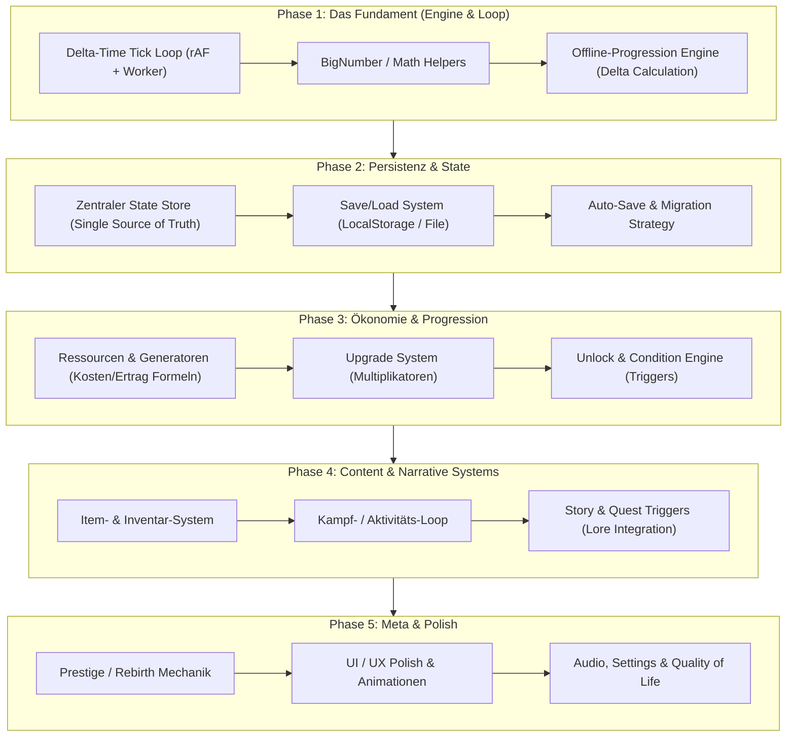

# Singleplayer Reboot - Entwicklungs-Flussmodell

Dieses Dokument beschreibt die empfohlene Entwicklungsreihenfolge und Systemarchitektur für den Neustart von **Archiv des Vergessens** als reines Singleplayer Idle-RPG.

---

## 1. Entwicklungs-Flussmodell (Mermaid Diagramm)

---

## 2. Detaillierte Phasen-Aufschlüsselung nach Priorität

### **Phase 1: Das Fundament (Engine & Time)**
*Fokus:* Exakte Zeitmessung und mathematische Präzision ohne Abhängigkeit von Grafiken oder Servern.
* **Delta-Time Tick Loop:** Ein robuster Loop (z.B. 10 Ticks/Sekunde oder `requestAnimationFrame` gekoppelt mit einem Web Worker für Hintergrund-Ticks).
* **BigNumber / Precision Handling:** Konsequente Entscheidung für Math-Bibliothek oder Nativ `BigInt` / `Decimal.js` treffen.
* **Offline-Progression Engine:** Exakte Zeitstempel-Berechnung (`Date.now() - lastTickTimestamp`) mit Obergrenzen für maximale Offline-Zeit.

---

### **Phase 2: State Management & Persistenz**
*Fokus:* Zuverlässige Speicherung und Nachvollziehbarkeit des Spielstands.
* **Zentraler Game State:** Ein einziger, transparenter State-Baum (z.B. Plain JS Object oder Proxy Store). Keine verstreuten lokalen Variablen in UI-Komponenten.
* **Save / Load System:** JSON-Serialisierung für `localStorage` oder Tauri-Dateisystem.
* **Schema-Versionierung:** Ein einfaches Migrations-System (`saveVersion`), damit alte Spielstände bei Updates nicht kaputtgehen.

---

### **Phase 3: Ökonomie & Core Progression Loop**
*Fokus:* Das eigentliche "Idle-Gameplay" & exponentielles Wachstum.
* **Ressourcen & Generatoren:** Basis-Ressourcen (z. B. Essen, Gold, Mana) und die mathematischen Formeln für Generatorkosten ($Cost = BaseCost \times Exponential^N$).
* **Upgrade System:** Statische und dynamische Multiplikatoren, die Ressourcen-Ertrag oder Kosten beeinflussen.
* **Freischalt-Bedingungen (Unlock Engine):** Mechanik, die Elemente im UI erst sichtbar/kaufbar macht, wenn Bedingungen erfüllt sind (z.B. "Besitze 100 Gold").

---

### **Phase 4: Content, Kampf & Narrative (Lore)**
*Fokus:* Spieltiefe und Story-Anbindung aus der Story Bible.
* **Item & Equipment System:** Stats, Ausrüstungsslots und Modifikatoren für den Spieler.
* **Aktivitäten / Kampf-Loop:** Automatische oder semi-automatische Aktivitäten (z. B. Erkundung, Dungeons, Bosskämpfe) basierend auf Ticks.
* **Story- & Quest-System:** Einbindung der Lore (`AAA_STORY_BIBLE.md`) über Event-Trigger (z.B. "Wenn Spieler Ebene 5 erreicht -> Zeige Story-Text").

---

### **Phase 5: Meta-Progression & Polish**
*Fokus:* Langzeitmotivation, Abrundung und Ästhetik.
* **Prestige / Reset-Mechanik:** Soft-Resets für Meta-Währung, die permanente Boni gewährt.
* **UI/UX Polish:** Smooth Animations, Floating Numbers, Responsive Tooltips, Sound-Effekte.
* **Settings & Export/Import:** Safe-Export als Base64/JSON-String, Lautstärke-Regler, Theme-Switch.

---

## 3. Goldene Regel für den Neustart
> **Fokussiere dich in Woche 1 ausschließlich auf Phase 1 & 2!**  
> Sobald du ein kleines Quadrat hast, das pro Sekunde +1 Ressource generiert und den Stand nach einem Browser-Reload wiederherstellt, hast du bereits ein funktionierendes Fundament, auf dem du den Rest stressfrei aufbauen kannst.
